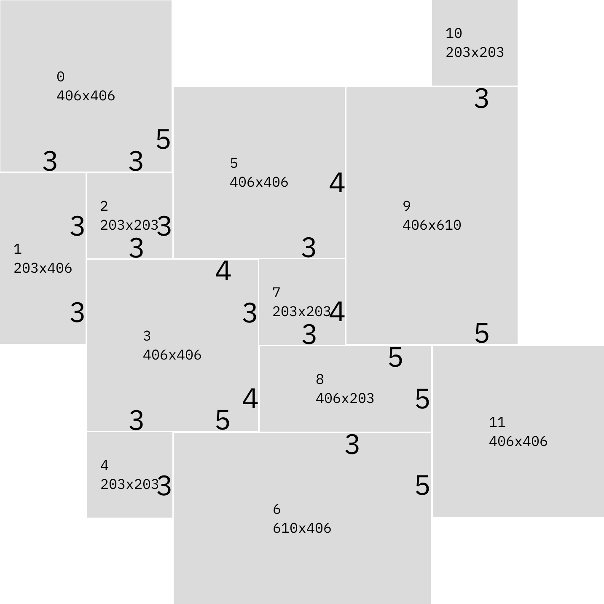

# Tiles: French Versailles Pattern Layout



An Elixir library is designed to layout axis-aligned tiles in the French Versailles pattern. This pattern employs four distinct tile sizes, such as 203x203, 406x406, 203x406, and 610x406 millimeters, arranged in a recurring pattern. The commonly utilized materials for this pattern include travertine, marble, limestone, and sandstone.

## Features

- **Pattern Generation**: Create repeating tile patterns with various dimensions
- **Spatial Analysis**: Calculate the sizes of adjacency gaps between tiles
- **Visual Rendering**: Generate images of tile layouts using libvips
- **Flexible Configuration**: Customize spacing, verbosity, and layout options

## Installation
Clone the tiles repo.

Then get the dependencies:

```bash
mix deps.get
```

## Quick Start

### Run the Livebook notebook for visual exploration
```bash
livebook server patterns.livemd
```

### Basic Tile Operations

```elixir
# Create a tile (rectangle)
tile = Tile.new(0, 0, 100, 100)

# Check if two tiles overlap
tile1 = Tile.new(0, 0, 50, 50)
tile2 = Tile.new(25, 25, 50, 50)
Tile.overlaps?(tile1, tile2)  # => true
```

### Generate Tile Patterns

```elixir
# Create a pattern with 3mm spacing
pattern = Tiles.new(3)

# Arrange tiles in a 1500x1500mm room
tiles = Tiles.arrange(pattern, 1500, 1500)

# Calculate the dimensions of the covered aria without cutting any tiles
{width, height} = Tiles.dimensions(tiles)

# Find adjacent tiles
adjacency = Tiles.find_adjacent(tiles)

# Calculate spacing between tiles
distances = Tiles.distances(tiles)
```

### Render Visual Layouts

```elixir
# Generate a room image with tiles
image = Room.new!(1500, 1500, [
  spacer: 3,
  verbose: 2,        # Show tile dimensions
  truncate: false,
  offset: 0
])

# Save the image
Vix.Vips.Image.write_to_file(image, "room_layout.png")
```

## Core Modules

### `Tile`

Represents a single axis-aligned rectangle with position and dimensions.

```elixir
# Create a tile at position (10, 20) with size 100x50
tile = Tile.new(10, 20, 100, 50)

# Access properties
tile.x        # => 10
tile.y        # => 20
tile.width    # => 100
tile.height   # => 50
```

### `Tiles`

Provides utilities for pattern generation and spatial analysis.

**Key Functions:**
- `new/1` - Create a repeating tile pattern
- `arrange/4` - Layout pattern across a room
- `find_adjacent/2` - Find neighboring tiles
- `distances/2` - Calculate gaps between adjacent tiles
- `dimensions/1` - Get bounding box dimensions
- `bounding_box/1` - Get enclosing rectangle

### `Room`

Renders tile layouts as images using libvips.

**Options:**
- `:spacer` - Gap between tiles in pixels (default: 3)
- `:verbose` - Text overlay level (0-4)
  - `0`: Show tile ID
  - `1`: Show tile index
  - `2`: Show dimensions (default)
  - `3`: Show index + dimensions
  - `4`: Show index + dimensions + position
- `:truncate` - Truncate tiles at room boundaries (default: false)
- `:offset` / `:offset_x` / `:offset_y` - Layout offsets

### `Color`

Assigns colors from a 6-color palette for visual differentiation.

## Development

### Running Tests

```bash
# Run all tests
mix test

# Run a specific test file
mix test test/tile_test.exs

# Run with coverage
mix test --cover
```

### Code Formatting

```bash
# Format all files
mix format

# Check formatting
mix format --check-formatted
```

### Interactive Development

```bash
# Start IEx with the project loaded
iex -S mix
```

## Pattern System

The library uses a 12-cell repeating pattern designed for floor tiles:

- **4 tile sizes**: 203×203, 406×406, 203×406, 610×406 (mm)
- **12 tiles per pattern**: Strategically arranged for visual appeal
- **Seamless tiling**: Pattern repeats across any room size
- **Automatic cycling**: Reuses tiles if fewer than needed

## Spatial Analysis

The adjacency detection system identifies neighboring tiles:

- **Tolerance-based**: Default 10px gap treated as adjacent
- **Overlap requirement**: Tiles must overlap on perpendicular axis
- **Distance calculation**: Returns exact gaps (dx, dy) between tiles
- **Use case**: Validate tile installation, detect spacing issues

## Examples

### Example 1: Generate and Analyze a Pattern

```elixir
# Create pattern and arrange in room
pattern = Tiles.new(3)
tiles = Tiles.arrange(pattern, 2000, 2000)

# Analyze the layout
{width, height} = Tiles.dimensions(tiles)
IO.puts("Layout size: #{width}×#{height}mm")

# Find tiles with incorrect spacing
distances = Tiles.distances(tiles, 10)
Tiles.filter(distances, 2, 4)  # Gaps between 2-4mm
```

### Example 2: Render Multiple Configurations

```elixir
# Generate different visualizations
for verbose_level <- 0..4 do
  image = Room.new!(1500, 1500, spacer: 3, verbose: verbose_level)
  Vix.Vips.Image.write_to_file(image, "layout_v#{verbose_level}.png")
end
```

## Requirements

- **Elixir**: ~> 1.18
- **Vix**: ~> 0.5 (libvips wrapper)
- **libvips**: Required for image generation (install via system package manager)

## License

This project is available as open source.
